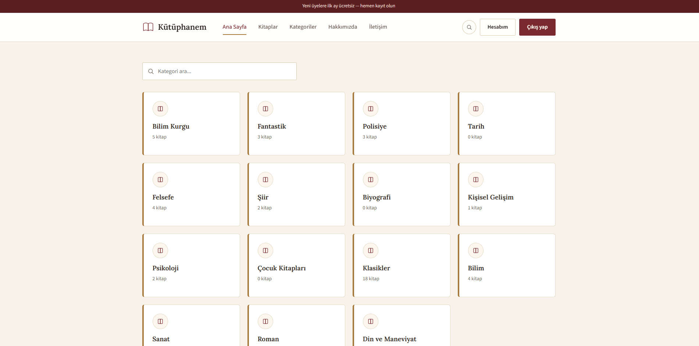
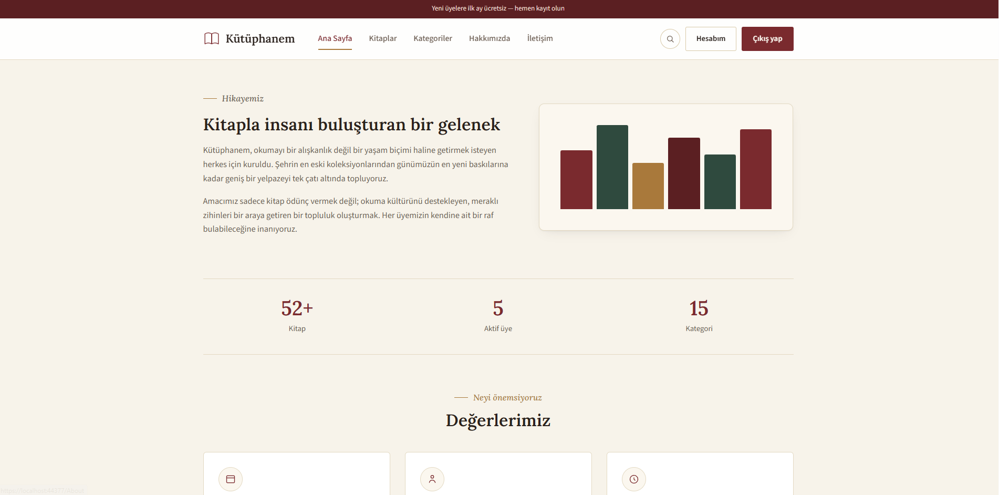
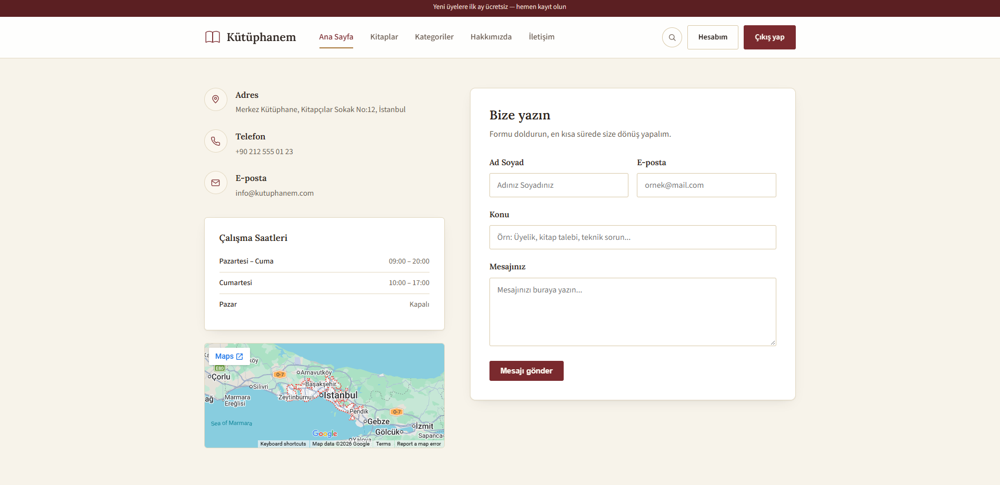

# 📚 MvcKutuphane

ASP.NET MVC (.NET Framework 4.7.2) ile geliştirilmiş, rol tabanlı yetkilendirmeye sahip tam kapsamlı bir **Kütüphane Yönetim Sistemi**. Hem yöneticiler hem de üyeler için ayrı paneller, kitap kataloğu, ödünç/iade takibi, ceza yönetimi ve üye istatistikleri içerir.


---

## ✨ Özellikler

### 🛡️ Admin Paneli
- 📊 Genel istatistikler ve grafiklerle **Dashboard**
- 📖 Kitap, yazar ve kategori yönetimi
- 🔄 Ödünç verme / iade işlemleri takibi
- 💸 Gecikme cezası yönetimi
- 👥 Üye listesi ve detayları
- 📬 Üyelerden gelen mesajların yönetimi
- 🔐 Rol tabanlı (Admin) yetkilendirme ile korumalı erişim

### 👤 Üye Paneli
- 🏠 Kişisel Dashboard
- 📚 Aktif ödünç kitapların takibi
- 💰 Ödenmiş / ödenmemiş cezaların görüntülenmesi
- 🔔 Duyurular
- 🙋 Profil ve şifre değiştirme
- 🤖 Yapay zeka destekli kitap önerisi

### 🌐 Genel Site
- 🏡 Ana sayfa ve tanıtım içerikleri
- 🗂️ Kategorilere göre kitap kataloğu (canlı arama filtreli)
- ℹ️ Hakkımızda / İletişim sayfaları
- 🚫 Özel tasarımlı hata sayfaları (401 / 403 / 404)

### 🔒 Güvenlik & Mimari
- `FormsAuthenticationTicket` ile **rol tabanlı** kimlik doğrulama (Admin / Member)
- Global `[Authorize]` filtresi + gerekli yerlerde `[AllowAnonymous]`
- Entity Framework (Database First) ile veri erişim katmanı

---

## 🛠️ Kullanılan Teknolojiler

| Katman | Teknoloji |
|---|---|
| Backend | ASP.NET MVC 5, C# |
| ORM | Entity Framework 6 |
| Veritabanı | Microsoft SQL Server |
| Frontend | Razor View Engine, HTML5, CSS3, JavaScript |
| Kimlik Doğrulama | Forms Authentication (Role-Based) |
| JSON | Newtonsoft.Json |

---

## 🖼️ Ekran Görüntüleri

### 🌐 Genel Site

<table>
<tr>
<td align="center"><br/><b>Ana Sayfa</b></td>
<td align="center"><br/><b>Ana Sayfa 2</b></td>
</tr>
<tr>
<td align="center"><br/><b>Ana Sayfa 3</b></td>
<td align="center"><br/><b>Kategoriler</b></td>
</tr>
<tr>
<td align="center"><br/><b>Kitaplar Sayfası</b></td>
<td align="center"><br/><b>Hakkımızda</b></td>
</tr>
<tr>
<td align="center"><br/><b>Hakkımızda 2</b></td>
<td align="center"><br/><b>İletişim</b></td>
</tr>
</table>

### 🛡️ Admin Paneli

<table>
<tr>
<td align="center"><br/><b>Dashboard</b></td>
<td align="center"><br/><b>İstatistikler</b></td>
</tr>
<tr>
<td align="center"><br/><b>Üye Listesi</b></td>
<td align="center"><br/><b>Ödünç İşlemleri</b></td>
</tr>
<tr>
<td align="center"><br/><b>İade Alınan Kitaplar</b></td>
<td align="center"><br/><b>Cezalar Listesi</b></td>
</tr>
<tr>
<td align="center"><br/><b>Gelen Mesajlar</b></td>
<td></td>
</tr>
</table>

### 👤 Üye Paneli

<table>
<tr>
<td align="center"><br/><b>Dashboard</b></td>
<td align="center"><br/><b>Profil</b></td>
</tr>
<tr>
<td align="center"><br/><b>Aktif Ödünç</b></td>
<td align="center"><br/><b>Şifre Değiştirme</b></td>
</tr>
<tr>
<td align="center"><br/><b>Ödenmemiş Cezalar</b></td>
<td align="center"><br/><b>Ödenmiş Cezalar</b></td>
</tr>
<tr>
<td align="center"><br/><b>Duyurular</b></td>
<td align="center"><br/><b>AI Kitap Önerisi</b></td>
</tr>
</table>

### 🚫 Hata Sayfaları

<table>
<tr>
<td align="center"><br/><b>404 - Sayfa Bulunamadı</b></td>
<td></td>
</tr>
</table>

---

## 🚀 Kurulum

1. Projeyi klonla:
   ```bash
   git clone https://github.com/EmreHaci03/MvcKutuphane.git
   ```
2. `Web.config` içindeki `connectionStrings` bölümünü kendi SQL Server bağlantı bilgilerinle güncelle.
3. Veritabanını oluştur / migrate et.
4. Visual Studio ile projeyi aç, gerekli NuGet paketlerini geri yükle (`Restore NuGet Packages`).
5. Projeyi çalıştır (F5).

---

## 🗄️ Veritabanı Tetikleyicileri & İş Mantığı

Ödünç/iade süreci iki katmana bölünmüş durumda: **kitap durumunun "ödünçte" işaretlenmesi veritabanı trigger'ıyla**, **iade ve ceza hesaplama ise tamamen uygulama (C#) katmanında** yapılıyor.

### ⚙️ SQL Trigger — `OduncKitap`

`TBL_HAREKET` tablosuna yeni bir ödünç kaydı (`INSERT`) düştüğü anda tetiklenir ve ilgili kitabın durumunu otomatik olarak **"ödünçte" (`DURUM = 0`)** yapar:

```sql
ALTER TRIGGER [dbo].[OduncKitap]
ON [dbo].[TBL_HAREKET]
AFTER INSERT
AS
BEGIN
    UPDATE TBL_KITAP
    SET DURUM = 0
    FROM TBL_KITAP
    INNER JOIN inserted ON TBL_KITAP.ID = inserted.KITAP
END
```

> Bu sayede `CreateLend` action'ı sadece `TBL_HAREKET`'e satır eklemekle sorumlu — kitabın "rafta değil" olarak işaretlenmesini uygulama kodu değil, veritabanı garanti ediyor.

### 🧠 Uygulama Katmanı — `BorrowedBooksController`

| İşlem | Nerede kontrol ediliyor | Ne yapıyor |
|---|---|---|
| **Ödünç verme** (`CreateLend`) | C# (controller) | Kitap müsait mi, üye/personel geçerli mi, üyenin **ödenmemiş cezası** var mı kontrol eder — varsa ödünç vermeyi engeller |
| **Kitap durumunu "ödünçte" yapma** | 🗄️ SQL Trigger (`OduncKitap`) | `TBL_HAREKET`'e satır eklenince otomatik tetiklenir |
| **İade alma** (`ReturnBook`) | C# (controller) | Kitabın `DURUM`'unu tekrar `true` (rafta) yapar — bu adımda trigger yok, tamamen koddan yönetiliyor |
| **Geç teslim cezası hesaplama** | C# (controller) | `IADETARIH` (beklenen iade) ile `UYEGETIRDIGITARIH` (gerçek iade) karşılaştırılır; gecikme varsa `gün sayısı × 10 TL` ceza hesaplanıp `TBL_CEZALAR`'a eklenir, ödeme süresi olarak 7 gün tanınır |
| **Ödenmemiş ceza kontrolü** | C# (controller) | `TBL_CEZALAR` tablosunda `ODENDI == false` kaydı olan üyeye yeni kitap ödünç verilmesi engellenir |

> Not: İade tarafında simetrik bir trigger (iade olunca `DURUM = 1` yapan) **yok** — bu bilinçli bir tasarım tercihi, çünkü iade anında aynı zamanda ceza hesaplanması gerekiyor ve bu mantık trigger'da değil kontrolcüde tutuluyor.

---

## 🔐 Rol Tabanlı Erişim

| Rol | Giriş Adresi | Erişebildiği Alan |
|---|---|---|
| **Admin** | `/AdminLogin` | Dashboard, kitap/üye/ceza yönetimi |
| **Member** | `/Account/Login` | Üye paneli, ödünç/ceza takibi, profil |

Kimlik doğrulama, `FormsAuthenticationTicket` içine gömülen rol bilgisiyle (`Admin` / `Member`) yapılır; her iki panel de birbirinin alanına yetkisiz erişimi engelleyecek şekilde korunur.

---

## 📌 Notlar

- Proje eğitim/portföy amaçlı geliştirilmiştir.
- Üretim ortamına alınmadan önce şifrelerin hash'lenmesi (ör. BCrypt) önerilir.

---

<p align="center">Made with ☕ and C#</p>
